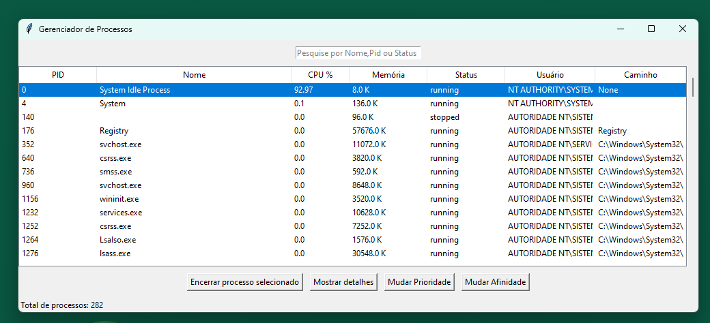

# TrabalhoSO
Trabalho da disciplina de Sistemas Operacionais 2025/1

Aluno: Micael Luan Conti

## Sobre

O trabalho tem como objetivo simular o gerenciador de tarefas do windows, possibilitando o encerramento de procesos, definicão de prioridade e afinidade.



## Instalar libs necessárias

```
pip install psutil ttkbootstrap
```

## Executar

Para melhor experiência inicie o editor de texto como administrador

```
python .\main.py
```